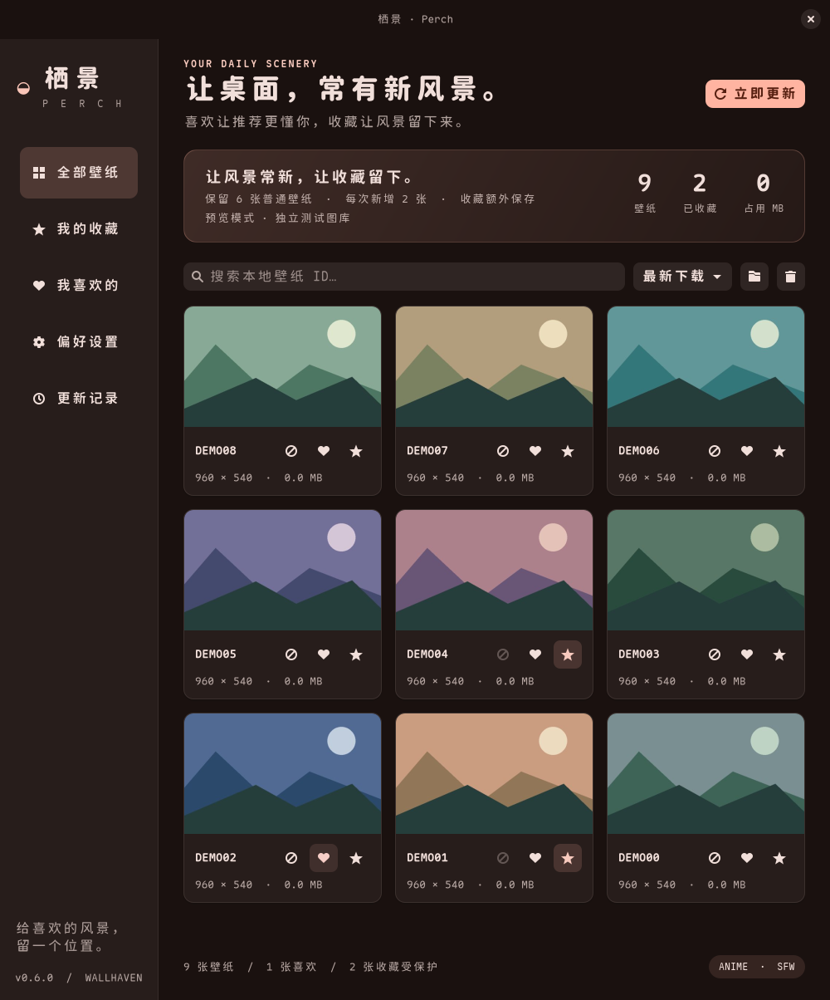
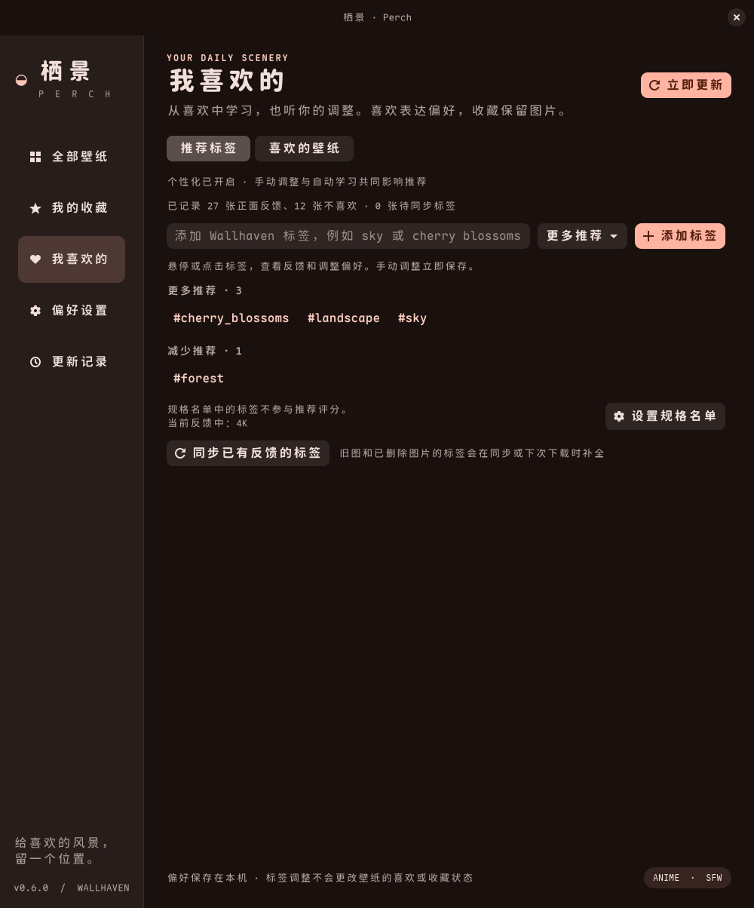

<div align="center">
  
  <h1>栖景 · Perch</h1>
  <p><strong>给喜欢的风景，留一个位置。</strong></p>
  <p>面向 Linux 的原生 Wallhaven 壁纸管理器 · GTK4 / libadwaita / Python</p>
</div>



栖景把 Wallhaven 的自动下载、定时更新和本地收藏放进一个原生桌面应用。它由原有的 `wallhaven-anime.py` 脚本发展而来，继续使用原来的图片目录、下载历史和 systemd 用户定时器。

## 可以做什么

- **本地图库**：缩略图、大图预览、ID 搜索、时间 / 大小排序、打开原图与来源。容量与更新计划概览仅在“全部壁纸”显示。
- **喜欢与收藏分开**：爱心表示喜欢，用于学习偏好，仍可能被清理；星标收藏保护图片，自动和手动清理都会跳过，且不占普通壁纸名额。
- **标签个性化**：在“我喜欢的”用紧凑的 `#hashtag` 查看推荐标签，悬停或点击后调整偏好。独立的规格名单支持增删，名单内的标签保持中立。
- **跟随桌面外观**：窗口、侧栏、按钮和浮层使用 GTK 的语义配色；保留栖景的圆角卡片、渐变概览与 hashtag 布局。在 niri / Hyprland 的 DMS 桌面优先读取 DMS 字体（如 Maple Mono NF CN），其他环境跟随 GTK；基础字号跟随 GTK，运行中修改字体也会同步。
- **先校准，再推荐**：积累 20 张有效反馈后启用自动标签偏好，单个标签至少需要 3 张反馈支持。开始时显示“自动校准中”，手动标签仍可使用。
- **不喜欢，换一张**：在卡片或大图预览中点击“不喜欢”，只下载一张新图替换当前图；预览会自动切换到新图，不喜欢的原图不再推荐。
- **可配置保留数量**：例如保留 20 张普通壁纸，加上 8 张收藏，总计 28 张。
- **按自己的节奏更新**：时段内每隔 1–24 小时更新，支持跨午夜；也可指定每天多个时间点。
- **后台运行**：关闭窗口后定时器仍然有效；可以暂停，也可以选择补执行错过的计划。
- **发现偏好**：关键词、热门 / 最新 / 随机 / 收藏排序、最低尺寸和严格比例。
- **清理前预览**：显示待删除的文件和空间，确认时重新检查收藏状态。
- **更新记录**：下载进度、错误与清理日志，后台任务和界面共用同一套下载逻辑。
- **设为桌面壁纸**：支持 DankMaterialShell、awww、swww 和 GNOME。自动检测优先顺序为 DMS → awww → swww → GNOME，也可手动指定。

默认只下载 **Anime / SFW 静态原图**，最低 3840×2160、严格 16:9，普通壁纸保留 20 张，每次新增 3 张；热门榜从月榜不足时扩展到年榜。SFW 依赖 Wallhaven 社区标签。

## 安装与启动

Arch Linux / EndeavourOS：

```bash
sudo pacman -S --needed python python-pillow python-gobject gtk4 libadwaita
bash install.sh
```

在应用菜单搜索 **栖景** 或 **Perch**，也可以执行：

```bash
~/.local/bin/perch
```

要求 Python 3.11+、GTK 4.12+、libadwaita 1.4+、Pillow 和 PyGObject，以及 systemd 用户会话。其他发行版安装对应软件包后，同样运行 `bash install.sh`。安装不需要 root；桌面壁纸后端需要另行安装并运行。

也可直接从源码启动：

```bash
python3 -m perch
```

保存全局设置时需要已安装后台服务。指定独立 `--config` 文件时只保存该文件，不操作系统定时器。

### 从旧脚本迁移

安装器会先备份旧安装，再短暂停止旧任务，更新程序并恢复定时器的启用状态。继续使用 `wallhaven-anime.service` / `.timer`，避免两套下载程序同时工作。旧版本的下载历史会直接读取，收藏表在原数据库中增量创建。

- 图片与下载历史不搬移、不清空。
- 原先已经启用的定时器继续启用，已经暂停的保持暂停。
- 默认的 00:00 / 06:00 / 12:00 / 18:00 时间点保留；旧定时器的补执行选项会继承。
- 自定义过旧定时器的用户，请安装后在 GUI 中重新设置时间点。
- 若存在旧服务的自定义 `.service.d/*.conf`，安装器会停止并提示先处理，避免旧命令行覆盖 GUI 设置。
- 原安装备份位于 `~/.local/state/perch/backups/<时间>/`，其中 `manifest.json` 记录每个原文件的备份位置；安装失败会自动恢复文件与定时器状态。

## 更新计划怎么计算

“时段内按间隔更新”以时段开始时间为基准，例如：

| 设置 | 每天执行时间 |
| --- | --- |
| 08:00–23:00，每 4 小时 | 08:00、12:00、16:00、20:00 |
| 22:00–04:00，每 2 小时 | 22:00、00:00、02:00、04:00 |
| 固定时间点 | 按输入的 HH:MM 列表执行 |

时间使用系统本地时区，实际触发精度为一分钟。时段限制的是**任务开始时间**，已经开始的下载可以继续到时段结束之后。开始与结束相同代表每天仅在这个时间点执行一次。

新安装默认不补执行，避免登录后在时段外下载。开启“错过计划后补执行一次”会使用 systemd 的 `Persistent=true`，可能在所选时段外补跑一次。电脑关机时不会下载，也不会主动唤醒休眠设备；依赖用户会话的后台运行，如需退出登录后继续，可自行配置 `loginctl enable-linger`。

## 喜欢、收藏与个性化

| 操作 | 推荐反馈 | 是否参与普通清理 |
| --- | --- | --- |
| ♥ 喜欢 | 正面反馈，提高相关标签优先级 | 会；想永久保留请另外收藏 |
| ★ 收藏 | 默认也是正面反馈，可在设置里关闭 | 不会，收藏始终受保护 |
| ⊘ 不喜欢 | 负面反馈，降低相关标签优先级并替换原图 | 新图成功保存后才移除原图 |

喜欢与收藏是独立状态，可以同时设置；同一张图片最多计算一次正面反馈。取消喜欢不会取消收藏，取消收藏也不会取消喜欢。不喜欢会移除该图片的喜欢状态，收藏图仍需先取消收藏才能点击不喜欢。旧版本的收藏不会被转换成可删除的喜欢。

喜欢过的图片被清理后，喜欢记录和已经获取的标签仍保存在本机，继续影响推荐。“我喜欢的 → 喜欢的壁纸”展示还在本地的喜欢图片。大图预览可以查看或同步 Wallhaven 标签。

### 自动校准

刚开始在“我喜欢的 → 推荐标签”显示 **自动校准中** 和收集进度，不展示或使用少量反馈推断出的正负偏好。累计 **20 张有效反馈** 后才启用自动标签搜索与排序；单个标签至少在 **3 张已评价图片** 中出现才参与自动推荐。喜欢、不喜欢、以及启用“收藏也参与推荐”后的收藏都可计入，同一图片只计算一次。

有效反馈需要已经同步至少一个可用的内容标签。未评价的下载图片、待同步图片、空标签、只有规格或已移除标签的图片不计入门槛。图片删除后反馈继续计入；取消反馈或调整中立名单后，样本不足会回到校准状态。

校准期间继续按原来的热门、最新或随机发现下载；明确不喜欢过的图片仍不再下载，反馈标签照常同步。**手动添加的标签偏好立即生效**，不必等待自动校准。恢复自动学习后，该标签也需满足校准与反馈数量条件才能再次出现。

[查看自动校准界面](docs/calibration.png)

### 手动调整推荐标签

打开 **我喜欢的 → 推荐标签**，标签会按“更多推荐”“减少推荐”“暂时中立”“已移除”分组，以可换行的 `#hashtag` 显示。悬停或点击标签后，在浮层中查看正负反馈次数、自动 / 手动来源和详细操作；鼠标移入浮层时它会保持打开，移开后关闭。也可以用 Tab 定位标签、回车打开、Esc 关闭。多词标签显示为 `#cherry_blossoms`，其实际名称仍为 `cherry blossoms`。

| 操作 | 效果 |
| --- | --- |
| 添加标签 | 输入 Wallhaven 标签名称，选择“更多推荐”或“减少推荐”；已有标签会更新偏好方向 |
| 更多推荐 / 减少推荐 | 手动方向优先于自动学习，一直保留到再次修改；减少推荐降低优先级，不完全屏蔽 |
| 移除标签 | 在浮层中移除后，标签变为中立，不再加分或减分；后续喜欢、不喜欢和同步不会自动加回 |
| 恢复自动学习 | 打开“已移除”标签的浮层并恢复，或把手动方向改为“自动学习”，重新按已有反馈计算 |

标签调整立即保存在本机，影响后续下载，不修改壁纸的喜欢、收藏状态，也不删除图片。可以重新添加已移除的标签。手动输入尚未缓存的名称时会按名称搜索；请使用 Wallhaven 上的实际标签名称，拼写错误可能没有匹配结果。恢复自动学习后，没有反馈的手动标签会从列表消失。

### 规格标签中立名单

在 **偏好设置 → 个性化推荐 → 管理规格标签中立名单** 中维护名单，也可从推荐标签页的“设置规格名单”进入。默认收录 **4K、8K、Ultra HD、3840×2160、16:9** 等常见规格，并自动识别遇到的像素尺寸与比例标签。输入名称即可加入，悬停或点击名单中的标签可移出；增删立即保存，重启与同步后仍然有效。

名单中的标签不会因喜欢而加分、因不喜欢而减分，也不用于偏好搜索；同样不参与评分的归一化分母。加入名单会暂时覆盖已有偏好，移出后恢复原有自动学习或手动调整。移出按完整名称生效，不会被自动识别重新加回；可随时再次加入。匹配忽略大小写、全角和多余空格，不把 `4koma` 等内容标签误当作 4K。

原图的标签信息始终保留，最低宽高、严格比例等尺寸筛选单独生效，规格名单的改动不修改它们。



[查看标签悬停操作](docs/tag-actions.png) · [查看规格标签名单](docs/spec-settings.png)

### 推荐如何工作

- 启用个性化时，更新前会补全旧反馈的标签；每次最多补全 24 张，缺失标签以后继续同步。新图下载后也会缓存标签。同步后的有效样本数达到 20 张时，本次更新即可启用自动偏好。
- 缓存 Wallhaven 标签 ID 与名称，以规范化名称合并标签偏好（忽略大小写、多余空格、全角差异）。每张正面图片对其标签计 +1，负面图片计 -1.5，并用样本数平滑分值。重复标签、同时喜欢和收藏都不会重复计分。
- 手动“更多推荐”的权重为 +1，“减少推荐”为 -1.5，优先于学习分值；移除标签和规格标签不计入分值或归一化分母，避免间接降低壁纸得分。
- 没有手动关键词时，额外查询最多两个偏好的标签，与原本的热门 / 随机 / 最新发现交替取得候选。设有关键词时严格保留关键词，只调整其结果的顺序。
- 每组最多评估 12 张合格新候选，按标签分值排序；每第四个候选保留原发现顺序，给新题材留出机会。这是候选排序规则，不保证最终下载中恰好有四分之一是新题材。
- 不喜欢降低相关标签的优先级，不会直接屏蔽整个标签；明确不喜欢过的图片 ID 仍不再下载。尺寸、比例、Anime 和 SFW 条件始终保留。
- 标签接口失败时继续使用缓存和普通发现，反馈不会丢失；失败的标签请求会冷却一小时。第一次补全旧数据或评估候选会增加等待时间，进度记入更新日志。

“偏好设置 → 个性化推荐”保留个性化总开关和收藏是否参与推荐的选项，标签管理与同步位于“我喜欢的”。关闭个性化后，手动调整仍会保存，重新开启后生效。喜欢、不喜欢、收藏及标签分值保存在本地；向 Wallhaven 仅发起图片、标签详情和搜索请求，不同步账户收藏，也不上传反馈记录。

## 收藏与清理规则

仅管理当前目录中符合 `wallhaven-六位ID.jpg/png/webp` 的普通文件。其他文件、子目录和符号链接不会参与清理。

1. 初次更新补满普通壁纸名额；正常更新新增指定数量。
2. 新图片下载、校验并落盘成功后，才淘汰最早下载的超额普通壁纸。
3. 收藏按 Wallhaven ID 保存在本机，始终排除在自动和手动清理之外。
4. 取消收藏不会立即删除图片；它会在后续超额清理时按下载时间参与淘汰。
5. 清理不会清空下载历史，已经下载并淘汰的 ID / 相同 SHA-256 内容不会重复下载。
6. 修改尺寸筛选不会删除已有图片；已有的损坏图片也保留并记录警告。
7. 网络失败或候选不足会记录原因。没有新图下载成功时，不会为了缩小保留数量提前删掉已有图片。
8. “不喜欢”独立于每次新增和保留数量，只替换所选图片，不清理其他壁纸。下载失败保留原图并显示“等待替换”；可以点击重试，后续自动更新也会优先替换它。收藏图需先取消收藏才能点击“不喜欢”。

在预览中点击“不喜欢”，下载完成后会直接显示新图；从图库点击时，新图出现在图库最前面。该操作不自动更换桌面背景，可再点击“设为桌面壁纸”。如果已有后台更新，替换任务会等待它完成。关闭窗口不会中断已经启动的替换任务。

收藏保护适用于栖景自身的清理，文件管理器或其他程序仍可删除图片。更改保存位置不会自动搬移原文件；所有目录共用这份下载历史和收藏记录。

## 数据位置

| 内容 | 默认位置 |
| --- | --- |
| 壁纸 | `~/Pictures/Wallpapers/` |
| 设置 | `~/.config/perch/config.json` |
| 下载历史、喜欢、收藏、不喜欢、标签、手动偏好和规格名单 | `~/.local/state/wallhaven-anime/history.sqlite3` |
| 日志 | `~/.local/state/wallhaven-anime/perch.log`，2 MB 轮转，保留两份旧日志 |
| 缩略图缓存 | `~/.local/state/wallhaven-anime/thumbnails/` |
| 应用程序 | `~/.local/share/perch/` |
| 更新计划 | `~/.config/systemd/user/wallhaven-anime.timer.d/perch.conf` |

配置和状态目录遵循 `XDG_CONFIG_HOME` / `XDG_STATE_HOME`，桌面入口遵循 `XDG_DATA_HOME`。程序与启动器使用固定的 `~/.local/share/perch`、`~/.local/bin`。

## 命令行

```bash
python3 -m perch update             # 手动下载，不需要打开 GUI
python3 -m perch sync-tags          # 补全已有反馈的标签，不下载或清理图片
python3 -m perch replace --wallpaper-id abc123  # 不喜欢并替换图库中的指定壁纸
python3 -m perch cleanup            # 仅预览超额清理
python3 -m perch cleanup --apply    # 执行清理，收藏仍受保护
python3 -m perch schedule           # 查看生成的定时器设置
systemctl --user status wallhaven-anime.timer
journalctl --user -u wallhaven-anime.service -n 50
```

保留旧脚本入口 `wallhaven-anime.py`；`--directory`、`--state-directory`、`--max-pages` 仍可用于本次运行。

HTTP(S) 代理可通过标准环境变量设置。后台任务的代理需设置在用户服务环境中；GUI 所在终端的变量不一定会被 systemd 服务继承。

## 开发与验证

```bash
python3 -m unittest discover -s tests -v
python3 -m compileall -q perch
bash -n install.sh
# 需要图形会话；生成独立测试图库，不修改真实壁纸和定时器
python3 tests/gui_smoke.py
```

测试覆盖收藏与清理、历史兼容、下载失败、内容去重、单张替换、跨午夜计划、设置与安装回滚、手动偏好和规格名单；也覆盖校准前不偏置、20 张启动门槛、单标签至少 3 张、反馈去重、手动偏好提前生效及同步后立即完成校准。GUI 测试会检查实际中文渲染使用的字体、DMS 文件变动后的字体更新、GTK 字体回退、深浅配色和校准界面，同时回归 hashtag 浮层、规格名单、图库、收藏、喜欢、设置与不喜欢后的单张替换流程，并把截图放在输出的 `/tmp/perch-gui-*` 目录。README 截图使用程序生成的几何图案，不包含下载的壁纸。

项目结构：`perch/gui.py` 是界面，`widgets.py` 提供 hashtag 浮层与字体跟随，`appearance.py` 读取桌面字体选择，`config.py` 管理设置，`library.py` 管理收藏和文件，`downloader.py` 下载与去重，`scheduler.py` 维护用户定时器，`recommendation.py` 负责校准、标签缓存同步和候选排序，`tag_policy.py` 负责名称归一化与规格标签规则。

## 上传 GitHub

仓库已使用 `main` 分支。先在 GitHub 建一个空仓库，再使用已配置的 SSH：

```bash
git remote add origin git@github.com:你的用户名/你的仓库名.git
git push -u origin main
```

本项目不包含本机壁纸、数据库、账户凭据或私钥。软件采用 [MIT License](LICENSE)，下载壁纸的版权归各自作者，许可证不覆盖它们。

## 停用与卸载

```bash
systemctl --user disable --now wallhaven-anime.timer
# 或卸载应用和定时服务，保留壁纸、收藏、历史、设置与安装备份
bash uninstall.sh
```

原脚本的使用说明保存在 [docs/legacy.md](docs/legacy.md)。

参考：[Wallhaven API](https://www.whvn.cc/help/api)、[GTK4](https://docs.gtk.org/gtk4/)、[DMS 壁纸接口](https://danklinux.com/docs/dankmaterialshell/keybinds-ipc#wallpaper)。
